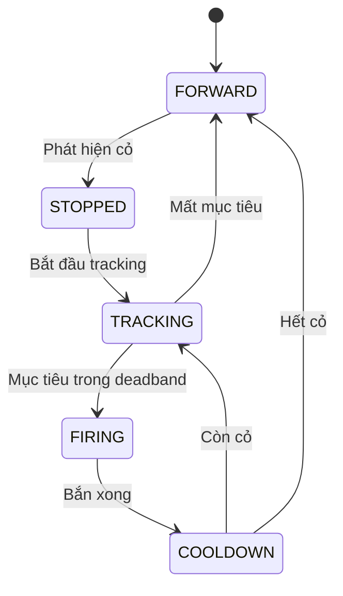

# 🌱 AI Weed Detection & Smart Crop Monitoring

Hệ thống phát hiện cỏ dại + giám sát cây trồng thông minh trên **Raspberry Pi 4B**, sử dụng **YOLOv8** realtime, servo pan/tilt, laser, motor L298N và Web Dashboard.

```
Camera → YOLOv8 → error_x/error_y → Servo → Laser → Motor
                                   → Crop Tracking → Web Dashboard
```

---

## 📁 Cấu trúc

```
detect-iot/
├── main.py                       # 🎯 Entry point chính (state machine + Web)
├── run_weed_laser.py             # 🔫 Multi-target weed + laser
├── requirements.txt              # 📦 Python dependencies
├── README.md                     # 📖 Tài liệu này
├── RUN_RASPBERRY_PI.md           # 📖 Hướng dẫn chạy trên Pi
├── yolov8n.pt                    # 🧠 YOLOv8 nano pretrained
├── config/                       # Cấu hình dataset YOLO
├── docs/CHUCNANG.md              # 📋 Roadmap tính năng
├── hardware/                     # 🔌 Điều khiển phần cứng
│   ├── wiring.py                 #    Pin mapping trung tâm
│   ├── laser_control.py          #    Laser (pulse, safety cap 1s)
│   ├── motor_l298n.py            #    Motor L298N
│   ├── servo_control.py          #    Servo GPIO PWM (dự phòng)
│   └── servo_pca9685.py          #    Servo PCA9685 (I2C)
├── models/                       # 🧠 Model đã train
│   ├── best.pt                   #    YOLOv8 PyTorch
│   └── best.onnx                 #    ONNX (tối ưu Pi)
├── utils/                        # 🛠 Tiện ích
│   ├── camera_pi.py              #    Camera USB / CSI
│   ├── coordinate_convert.py     #    Pixel → góc servo
│   ├── rt_tasks.py               #    Real-time helpers
│   └── shared_state.py           #    Thread-safe state (Web ↔ detection)
├── webapp/                       # 🌐 Web Dashboard
│   ├── app.py                    #    Flask server + API
│   ├── templates/index.html      #    Giao diện
│   └── static/style.css          #    CSS
├── scripts/                      # 📜 Scripts
│   ├── selftest_pi_hardware.py   #    Test phần cứng
│   ├── setup_samba_pi.sh         #    Samba share
│   └── deploy.sh                 #    Auto-deploy Pi
└── captures/                     # 📷 Ảnh chụp cây trồng
```

---

## 🧩 Tính năng

| Tính năng           | Mô tả                                                           |
| ------------------- | --------------------------------------------------------------- |
| **YOLOv8 Realtime** | Detect cỏ dại + cây trồng, hỗ trợ `.pt` và `.onnx`              |
| **State Machine**   | `FORWARD → STOPPED → TRACKING → FIRING → COOLDOWN`              |
| **Servo Pan/Tilt**  | PCA9685 (I2C), góc 20-160°, offset calibration                  |
| **Laser Pulse**     | Bắn xung 50ms, safety cap 1s, try/finally off                   |
| **Motor L298N**     | Tự hành, dừng khi phát hiện cỏ, chống spam GPIO                 |
| **Web Dashboard**   | Flask tại `http://<pi-ip>:5000` — camera live, stats, cây trồng |
| **Crop Tracking**   | Theo dõi cây, chụp ảnh, phân loại giai đoạn, lịch sử            |
| **Signal Handler**  | SIGTERM/SIGINT → laser OFF < 100ms                              |
| **Simulation Mode** | Chạy test trên PC không cần GPIO                                |

---

## 🔌 Sơ đồ đấu nối

| Thành phần | Kết nối       | Pin      |
| ---------- | ------------- | -------- |
| Servo Pan  | PCA9685 Ch.14 | I2C      |
| Servo Tilt | PCA9685 Ch.15 | I2C      |
| Laser      | Transistor    | BOARD 16 |
| Motor IN3  | L298N         | BOARD 32 |
| Motor IN4  | L298N         | BOARD 33 |

> Thay đổi pin trong `hardware/wiring.py`

---

## 🚀 Cài đặt & Chạy

### Cài nhanh (1 lệnh)

```bash
sudo bash scripts/deploy.sh
```

### Cài thủ công

```bash
# 1. Dependencies
sudo apt update && sudo apt install -y python3-pip python3-picamera2 i2c-tools
sudo raspi-config nonint do_i2c 0
sudo raspi-config nonint do_camera 0
pip install -r requirements.txt
pip install adafruit-circuitpython-servokit flask

# 2. Thư mục
mkdir -p logs captures models

# 3. Copy model
scp best.pt pi@<ip>:/home/pi/detect-iot/models/
```

### Chạy

```bash
# Production (có Web Dashboard)
python main.py --picam2 --web --fps 8

# Debug có cửa sổ
python main.py --camera 0 --show

# Multi-target weed + laser
python run_weed_laser.py --pca9685 --show --state-debug-log

# Hardware self-test
python scripts/selftest_pi_hardware.py
```

---

## ⚙️ Tham số CLI (`main.py`)

| Tham số               | Mặc định         | Ý nghĩa                     |
| --------------------- | ---------------- | --------------------------- |
| `--model`             | `models/best.pt` | Đường dẫn model             |
| `--camera`            | `0`              | Index camera USB            |
| `--picam2`            | tắt              | Dùng Pi Camera CSI          |
| `--conf`              | `0.2`            | Ngưỡng confidence           |
| `--fps`               | `10`             | FPS mục tiêu                |
| `--imgsz`             | `320`            | Kích thước inference        |
| `--show`              | tắt              | Cửa sổ debug                |
| `--web`               | tắt              | Bật Web Dashboard           |
| `--web-port`          | `5000`           | Port dashboard              |
| `--pan-gain`          | `0.06`           | Hệ số P servo pan           |
| `--tilt-gain`         | `0.06`           | Hệ số P servo tilt          |
| `--offset-pan`        | `0`              | Calibrate laser-camera (độ) |
| `--offset-tilt`       | `0`              | Calibrate laser-camera (độ) |
| `--laser-pulse-ms`    | `50`             | Thời gian bắn laser (ms)    |
| `--max-shots`         | `3`              | Số phát tối đa / 1 cỏ       |
| `--state-timeout-sec` | `30`             | Watchdog force FORWARD      |

---

## 🔄 State Machine



---

## 🌐 Web Dashboard

Truy cập `http://<pi-ip>:5000` khi chạy với `--web`.

| Trang            | Mô tả                                            |
| ---------------- | ------------------------------------------------ |
| **Tổng Quan**    | Camera trực tiếp, 4 KPI cards, biểu đồ hoạt động |
| **Cây Trồng**    | Bảng danh sách, tìm kiếm, lọc, click → chi tiết  |
| **Chi tiết cây** | Ảnh chụp, kích thước, giai đoạn, lịch sử, mô tả  |

### API Endpoints

| Endpoint                       | Mô tả                 |
| ------------------------------ | --------------------- |
| `GET /`                        | Dashboard HTML        |
| `GET /video_feed`              | MJPEG stream (20 FPS) |
| `GET /api/stats`               | JSON thống kê         |
| `GET /api/plants`              | JSON danh sách cây    |
| `GET /api/plants/<id>`         | JSON chi tiết cây     |
| `GET /api/plants/<id>/image`   | Ảnh chụp cây          |
| `GET /api/plants/<id>/history` | Lịch sử tăng trưởng   |
| `GET /health`                  | Health check          |

---

## 🛡️ An toàn

| Cơ chế               | Mô tả                                         |
| -------------------- | --------------------------------------------- |
| **Laser hard cap**   | Tối đa 1s/pulse, `try/finally` đảm bảo off    |
| **SIGTERM handler**  | `kill` / `systemctl stop` → laser OFF < 100ms |
| **Watchdog**         | State kẹt > 30s → force FORWARD               |
| **Max shots**        | Tối đa 3 phát/cỏ → chạy tiếp                  |
| **Failsafe finally** | Laser OFF trước mọi cleanup                   |
| **GPIO isolation**   | Mỗi module tự cleanup pin riêng               |

---

## 🚀 Tự động chạy với systemd

### Cài service

```bash
sudo cp scripts/weed-detect.service /etc/systemd/system/
sudo systemctl daemon-reload
sudo systemctl enable weed-detect
sudo systemctl start weed-detect
```

### Quản lý

```bash
sudo systemctl status weed-detect     # Kiểm tra trạng thái
sudo systemctl stop weed-detect       # Dừng
sudo systemctl restart weed-detect    # Khởi động lại
sudo journalctl -u weed-detect -f     # Xem log realtime
```

---

## 🔮 Hướng phát triển tương lai

### Ngắn hạn

- [ ] Nhận diện nhiều loại cây (Lettuce, Tomato, Cabbage...)
- [ ] Đếm số lượng từng loại cây
- [ ] Lưu ảnh + CSV history tự động
- [ ] Biểu đồ tăng trưởng trên dashboard
- [ ] Cảnh báo cây phát triển bất thường

### Dài hạn

- [ ] **Cloud sync** — gửi dữ liệu lên server từ xa
- [ ] **Mobile app** — xem dashboard trên điện thoại
- [ ] **Multi-Pi** — nhiều robot cùng hoạt động, 1 dashboard tổng
- [ ] **AI nâng cao** — phân loại sâu bệnh, dự đoán năng suất
- [ ] **Auto-calibrate** — tự động calibrate laser-camera
- [ ] **Solar power** — chạy bằng pin mặt trời ngoài đồng
- [ ] **GPS mapping** — bản đồ vườn với vị trí từng cây
- [ ] **Weather integration** — kết hợp dữ liệu thời tiết

---

## 🎯 Hướng dẫn calibrate để bắn TRÚNG

> **Code đã sẵn sàng bắn laser an toàn và đúng logic.** Nhưng bắn TRÚNG = **code đúng + calibrate offset + servo gain phù hợp + laser công suất đủ + model nhận diện được.**

### 1. Calibrate offset laser-camera (QUAN TRỌNG NHẤT)

Camera và laser nằm ở 2 vị trí khác nhau → laser không trùng tâm camera. Phải đo và bù offset:

```bash
# Test bằng giấy A4 in 1 cây cỏ
sudo python main.py --picam2 --show --offset-pan 0 --offset-tilt 0

# Quan sát: laser bắn lệch bao nhiêu so với tâm cây?
# Ví dụ lệch sang phải 2cm, lên trên 1cm
# → đổi offset:
sudo python main.py --picam2 --show --offset-pan -3 --offset-tilt 2
# (số âm/dương tùy hướng lệch, đơn vị độ servo)

# Lặp lại đến khi laser trúng tâm
```

### 2. Khoảng cách camera-mặt đất phải cố định

Code chuyển pixel → góc servo dùng FOV camera, **giả định khoảng cách cố định**. Lắp camera + laser cứng cáp, chiều cao 30-50cm so với mặt đất.

### 3. Servo gain hợp lý

Mặc định `pan_gain=0.06`, `tilt_gain=0.06`:

| Gain     | Hiệu ứng                                 |
| -------- | ---------------------------------------- |
| Quá cao  | Servo dao động qua lại tâm, không settle |
| Quá thấp | Servo di chuyển chậm, không kịp aim      |

Nếu servo "lắc lư" → giảm gain xuống `0.03-0.04`.

### 4. Laser công suất phù hợp

| Công suất     | Hiệu quả           | Pulse khuyến nghị |
| ------------- | ------------------ | ----------------- |
| 5mW (bút chỉ) | Không diệt được cỏ | —                 |
| 500mW-1W      | Diệt được cỏ non   | 200-500ms         |
| >2W           | Diệt cỏ cứng       | 100-300ms         |

```bash
# Tăng pulse khi đã calibrate xong:
sudo python main.py --picam2 --laser-pulse-ms 300
```

### 5. Model phải nhận diện được cỏ

```bash
yolo predict model=models/best.pt source=test_weed.jpg conf=0.5
```

Nếu model không nhận → train lại.

---

## ✅ Checklist trước khi test bắn thật

| #   | Bước                                                          |     |
| --- | ------------------------------------------------------------- | --- |
| 1   | Self-test hardware (`scripts/selftest_pi_hardware.py`) PASS   | ☐   |
| 2   | YOLO predict trên ảnh test → nhận diện đúng                   | ☐   |
| 3   | Test với `--show` xem bbox có đúng vị trí cỏ không            | ☐   |
| 4   | Chạy với laser **TẮT** (rút dây) xem servo aim đúng không     | ☐   |
| 5   | Cắm laser 5mW, bắn vào giấy A4, đo offset                     | ☐   |
| 6   | Calibrate `--offset-pan` và `--offset-tilt` đến khi trúng tâm | ☐   |
| 7   | Tăng `--laser-pulse-ms` lên 200-500ms                         | ☐   |
| 8   | Đổi sang laser công suất cao (>500mW)                         | ☐   |
| 9   | **ĐEO KÍNH BẢO HỘ LASER** trước khi bật laser mạnh            | ☐   |
| 10  | Test ngoài thực tế                                            | ☐   |

> ⚠️ **Cảnh báo**: Đeo **kính bảo hộ laser** (laser safety goggles) đúng bước sóng (532nm/650nm/808nm…) **trước khi bật laser > 5mW**. Laser công suất cao chiếu vào mắt = **mù vĩnh viễn trong giây**.

---

## 📋 Yêu cầu phần cứng

- Raspberry Pi 4B (2GB+ RAM, 64-bit OS)
- Camera USB hoặc Pi Camera v2/v3
- PCA9685 Servo Driver
- 2× Servo (pan + tilt)
- Laser diode + transistor
- L298N Motor Driver + DC motor
- Nguồn ngoài cho servo & motor

---

## 📝 Ghi chú

- Model class: `0 = crop`, `1 = weed`
- Chạy trên PC không GPIO: tự động simulation mode
- Pin mapping tập trung tại `hardware/wiring.py`
- Web dashboard chạy độc lập: `python webapp/app.py`

---

## 👤 Tác giả

**ĐÀO VĂN PHONG**

---
