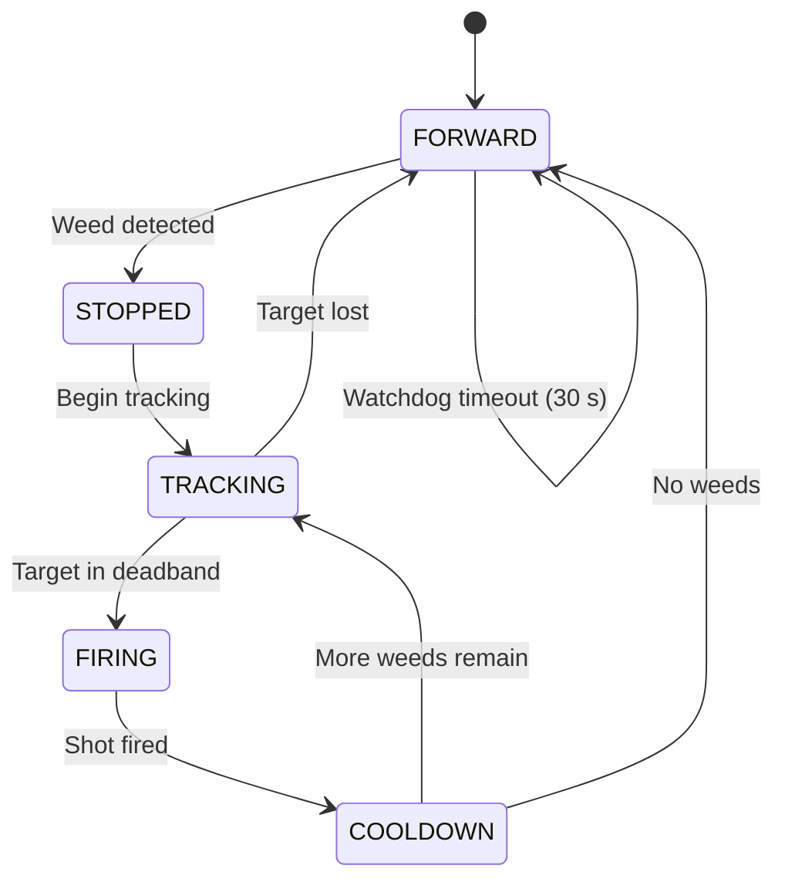

<div align="center">

<h1>🌱 AI Weed Detection & Smart Crop Monitoring</h1>

<p>
  <strong>Real-time AI-powered weed detection and crop monitoring system</strong><br/>
  Running on Raspberry Pi 4B · YOLOv8 inference · Servo pan/tilt targeting · Laser elimination · Live Web Dashboard
</p>

<br/>

[](https://python.org)
[](https://docs.ultralytics.com)
[](https://www.raspberrypi.com)
[](https://flask.palletsprojects.com)
[](LICENSE)
[]()

<br/>

[📖 Getting Started](#-getting-started) · [🔌 Hardware](#-hardware) · [🌐 Web Dashboard](#-web-dashboard) · [🛡️ Safety](#️-safety-system) · [🗺️ Roadmap](#️-roadmap)

</div>

---

## 📌 Overview

**AI Weed Detection** is an embedded system running on a **Raspberry Pi 4B** that uses **YOLOv8** to detect weeds and monitor crops in real time. When a weed is detected, the system:

- Controls a **servo pan/tilt** (PCA9685 over I²C) to aim precisely at the target
- Fires a **calibrated laser pulse** to eliminate the weed
- Halts the **L298N motor driver** during the elimination sequence
- Logs all events and streams live data to the **Web Dashboard**

```
Camera ──→ YOLOv8 ──→ error_x / error_y ──→ Servo Pan/Tilt ──→ Laser
                  └──→ Crop Tracker ──→ Web Dashboard (Flask :5000)
```

<details>
<summary>📊 Full pipeline diagram</summary>

```
┌──────────────────────────────────────────────────────────────┐
│                      Raspberry Pi 4B                         │
│                                                              │
│  Camera (USB / CSI)                                          │
│        │                                                     │
│        ▼                                                     │
│  YOLOv8 Inference  (.pt / .onnx)                             │
│        │                                                     │
│        ├── class: weed ──→ State Machine                     │
│        │                   FORWARD → STOPPED                 │
│        │                   → TRACKING → FIRING               │
│        │                   → COOLDOWN                        │
│        │                        │                            │
│        │                   Servo PCA9685  (pan / tilt)       │
│        │                   Laser pulse   (50 ms, cap 1 s)    │
│        │                   Motor L298N   (stop / resume)     │
│        │                                                     │
│        └── class: crop ──→ Crop Tracker                      │
│                             → Capture image                  │
│                             → Classify growth stage          │
│                             → Store growth history           │
│                                  │                           │
│                             Web Dashboard  :5000             │
└──────────────────────────────────────────────────────────────┘
```

</details>

---

## ✨ Features

| | Feature | Description |
|--|---------|-------------|
| 🧠 | **YOLOv8 Real-time Inference** | Supports `.pt` and `.onnx`; auto-selects the optimal backend |
| 🔄 | **5-State Machine** | `FORWARD → STOPPED → TRACKING → FIRING → COOLDOWN` |
| 🎯 | **Servo Pan/Tilt** | PCA9685 I²C, 20–160°, P-controller with offset calibration |
| 🔦 | **Laser Pulse** | 50 ms pulse, 1 s hard cap, `try/finally` guarantees laser OFF |
| ⚙️ | **Motor L298N** | Autonomous drive; stops on weed detection; debounced GPIO |
| 🌐 | **Web Dashboard** | Flask `:5000` — live MJPEG stream, KPI cards, crop management |
| 🌿 | **Crop Tracking** | Snapshot capture, stage classification, growth history log |
| 🛡️ | **Safety System** | SIGTERM handler, 30 s watchdog, laser failsafe |
| 💻 | **Simulation Mode** | Full functionality on PC without GPIO hardware |

---

## 📁 Project Structure

```
detect-iot/
│
├── main.py                        # Entry point — state machine + web server
├── run_weed_laser.py              # Multi-target weed + laser runner
├── requirements.txt               # Python dependencies
│
├── hardware/                      # Hardware abstraction layer
│   ├── wiring.py                  #   Central pin mapping
│   ├── laser_control.py           #   Laser pulse + safety cap
│   ├── motor_l298n.py             #   L298N motor driver
│   ├── servo_control.py           #   Servo GPIO PWM (fallback)
│   └── servo_pca9685.py           #   Servo PCA9685 I²C (primary)
│
├── models/                        # Trained model weights
│   ├── best.pt                    #   YOLOv8 PyTorch
│   └── best.onnx                  #   ONNX — optimised for Pi
│
├── utils/                         # Utility modules
│   ├── camera_pi.py               #   USB / CSI camera abstraction
│   ├── coordinate_convert.py      #   Pixel → servo angle
│   ├── rt_tasks.py                #   Real-time task helpers
│   └── shared_state.py            #   Thread-safe state (Web ↔ detection)
│
├── webapp/                        # Web Dashboard
│   ├── app.py                     #   Flask server + REST API
│   ├── templates/index.html       #   Dashboard UI
│   └── static/style.css           #   Stylesheet
│
├── scripts/                       # Utility scripts
│   ├── selftest_pi_hardware.py    #   Hardware self-test
│   ├── setup_samba_pi.sh          #   Samba file share setup
│   └── deploy.sh                  #   One-command deploy
│
├── config/                        # YOLO dataset config
├── captures/                      # Crop snapshot storage
└── docs/
    └── CHUCNANG.md                # Feature roadmap (Vietnamese)
```

> **Note:** All GPIO pin assignments are centralised in `hardware/wiring.py`.  
> Model classes: `0 = crop` · `1 = weed`

---

## 🔌 Hardware

### Bill of Materials

| Component | Model | Interface | Notes |
|-----------|-------|-----------|-------|
| SBC | Raspberry Pi 4B 2 GB+ | — | 64-bit OS required |
| Camera | USB Webcam / Pi Camera v2 / v3 | USB / CSI | |
| Servo Driver | PCA9685 16-ch | I²C | |
| Pan Servo | Standard Servo | PCA9685 Ch.14 | 20–160° |
| Tilt Servo | Standard Servo | PCA9685 Ch.15 | 20–160° |
| Laser | Diode + NPN Transistor | BOARD 16 | See safety warning |
| Motor Driver | L298N | BOARD 32, 33 | |

### Wiring Diagram

```
Raspberry Pi 4B
│
├── I²C SDA/SCL ──────────────→ PCA9685
│                                  ├── Ch.14 ──→ Servo Pan
│                                  └── Ch.15 ──→ Servo Tilt
│
├── BOARD 16 ──→ NPN Transistor ──→ Laser (+)
│
├── BOARD 32 ──────────────────→ L298N IN3
└── BOARD 33 ──────────────────→ L298N IN4
```

---

## 🚀 Getting Started

### Prerequisites

- Raspberry Pi 4B — Raspberry Pi OS **64-bit** (Bullseye / Bookworm)
- Python **3.9+**
- I²C and Camera interfaces **enabled** via `raspi-config`

### 1 — Clone the repository

```bash
git clone https://github.com/your-username/ai-weed-detection.git
cd ai-weed-detection
```

### 2 — Install dependencies

**Option A — One-command deploy (recommended)**

```bash
sudo bash scripts/deploy.sh
```

**Option B — Manual install**

```bash
# System packages
sudo apt update && sudo apt install -y python3-pip python3-picamera2 i2c-tools

# Enable I²C & Camera
sudo raspi-config nonint do_i2c 0
sudo raspi-config nonint do_camera 0

# Python packages
pip install -r requirements.txt
pip install adafruit-circuitpython-servokit flask

# Create required directories
mkdir -p logs captures models

# Copy trained model to the Pi
scp best.pt pi@<pi-ip>:/home/pi/ai-weed-detection/models/
```

### 3 — Run

```bash
# Production — Web Dashboard enabled
python main.py --picam2 --web --fps 8

# Debug — with on-screen preview
python main.py --camera 0 --show

# Multi-target weed + laser runner
python run_weed_laser.py --pca9685 --show --state-debug-log

# Hardware self-test
python scripts/selftest_pi_hardware.py

# Web Dashboard standalone
python webapp/app.py
```

---

## ⚙️ CLI Reference

```bash
python main.py [OPTIONS]
```

| Option | Default | Description |
|--------|---------|-------------|
| `--model PATH` | `models/best.pt` | Model path — `.pt` or `.onnx` |
| `--camera INT` | `0` | USB camera device index |
| `--picam2` | `False` | Use Pi Camera Module (CSI) |
| `--conf FLOAT` | `0.2` | Detection confidence threshold |
| `--fps INT` | `10` | Target inference FPS |
| `--imgsz INT` | `320` | Inference input size (px) |
| `--show` | `False` | Show debug preview window |
| `--web` | `False` | Enable Web Dashboard |
| `--web-port INT` | `5000` | Web Dashboard port |
| `--pan-gain FLOAT` | `0.06` | P-gain — pan servo |
| `--tilt-gain FLOAT` | `0.06` | P-gain — tilt servo |
| `--offset-pan FLOAT` | `0` | Laser-camera pan offset (°) |
| `--offset-tilt FLOAT` | `0` | Laser-camera tilt offset (°) |
| `--laser-pulse-ms INT` | `50` | Laser pulse duration (ms) |
| `--max-shots INT` | `3` | Max shots per weed target |
| `--state-timeout-sec INT` | `30` | Watchdog reset timeout (s) |

---

## 🔄 State Machine



---

## 🌐 Web Dashboard

Access **`http://<pi-ip>:5000`** when running with the `--web` flag.

### Pages

| Page | Description |
|------|-------------|
| **Overview** | Live MJPEG stream · 4 KPI cards · Activity chart |
| **Crop List** | Full plant table · Search · Filter by stage |
| **Crop Detail** | Snapshot · Dimensions · Growth stage · History timeline |

### REST API

| Method | Endpoint | Description |
|--------|----------|-------------|
| `GET` | `/` | Dashboard HTML |
| `GET` | `/video_feed` | MJPEG live stream (20 FPS) |
| `GET` | `/api/stats` | Detection statistics |
| `GET` | `/api/plants` | Plant list |
| `GET` | `/api/plants/<id>` | Plant detail |
| `GET` | `/api/plants/<id>/image` | Plant snapshot |
| `GET` | `/api/plants/<id>/history` | Growth history |
| `GET` | `/health` | Health check |

---

## 🛡️ Safety System

| Mechanism | Behaviour |
|-----------|-----------|
| **Laser hard cap** | Max 1 000 ms per pulse — `try/finally` guarantees OFF |
| **SIGTERM handler** | `systemctl stop` → laser OFF in < 100 ms |
| **Watchdog** | State stuck > 30 s → force `FORWARD` |
| **Max shots** | 3 shots per weed target, then resume movement |
| **Failsafe finally** | Laser disabled before any cleanup routine |
| **GPIO isolation** | Each hardware module handles its own pin cleanup |

> [!WARNING]
> Always wear **laser safety goggles** rated for your laser's wavelength before enabling any laser > 5 mW.  
> High-power laser exposure to eyes causes **permanent blindness**.

---

## 🎯 Laser Calibration Guide

> **Formula for accurate hits:** Correct code + calibrated offset + tuned gain + sufficient laser power + well-trained model.

### Step 1 — Calibrate laser-camera offset

```bash
# Start with zero offset; fire at an A4 sheet
python main.py --picam2 --show --offset-pan 0 --offset-tilt 0

# Measure laser deviation from bbox centre, then adjust
python main.py --picam2 --show --offset-pan -3 --offset-tilt 2

# Iterate until the laser hits the bbox centre consistently
```

### Step 2 — Tune servo gain

| Gain Value | Behaviour |
|------------|-----------|
| `> 0.10` | ❌ Servo oscillates, cannot settle |
| `0.04 – 0.07` | ✅ Smooth tracking, fast settle |
| `< 0.02` | ❌ Too slow, cannot track in time |

### Step 3 — Select laser power

| Power | Target | Pulse Duration |
|-------|--------|----------------|
| 5 mW | Calibration / offset tuning only | — |
| 500 mW – 1 W | Young / soft weeds | 200–500 ms |
| > 2 W | Mature / thick weeds | 100–300 ms |

```bash
# After calibration, increase pulse duration as needed
python main.py --picam2 --laser-pulse-ms 300
```

---

## ✅ Pre-flight Checklist

```
☐  1.  Run selftest_pi_hardware.py → ALL PASS
☐  2.  YOLO predict on a test image → detections correct
☐  3.  Run with --show → bounding boxes positioned correctly
☐  4.  Disconnect laser → verify servo aims in the right direction
☐  5.  Connect 5 mW laser → fire at A4 paper → measure offset
☐  6.  Calibrate --offset-pan & --offset-tilt → laser hits centre
☐  7.  Increase --laser-pulse-ms to 200–500 ms
☐  8.  Switch to high-power laser (> 500 mW)
☐  9.  ⚠️  PUT ON LASER SAFETY GOGGLES before enabling high-power laser
☐  10. Field test
```

---

## 🔧 Run as a Systemd Service

```bash
# Install and enable
sudo cp scripts/weed-detect.service /etc/systemd/system/
sudo systemctl daemon-reload
sudo systemctl enable --now weed-detect

# Common management commands
sudo systemctl status weed-detect        # Check status
sudo systemctl stop weed-detect          # Stop service
sudo systemctl restart weed-detect       # Restart service
sudo journalctl -u weed-detect -f        # Follow live logs
```

---

## 🗺️ Roadmap

### ✅ v1.0 — Released

- [x] YOLOv8 real-time inference — `.pt` & `.onnx` backends
- [x] 5-state machine — `FORWARD / STOPPED / TRACKING / FIRING / COOLDOWN`
- [x] Servo pan/tilt — PCA9685 + P-controller + offset calibration
- [x] Laser pulse — safety hard cap + `try/finally` failsafe
- [x] Motor L298N — auto-stop on weed detection
- [x] Web Dashboard — Flask, MJPEG stream, REST API
- [x] Crop tracking — capture, stage classification, growth history
- [x] Graceful shutdown — SIGTERM / SIGINT handling
- [x] Simulation mode — runs on PC without GPIO

### 🚧 v1.1 — In Progress

- [ ] Multi-class crop detection — Lettuce, Tomato, Cabbage, etc.
- [ ] Per-species plant count
- [ ] Auto CSV history export
- [ ] Growth trend chart on dashboard
- [ ] Abnormal growth alert / notification system

### 📋 v2.0 — Planned

- [ ] **Cloud sync** — push telemetry & images to remote server
- [ ] **Mobile app** — real-time dashboard for Android / iOS
- [ ] **Multi-Pi mesh** — multiple robots, unified dashboard
- [ ] **Advanced AI** — disease classification, yield prediction
- [ ] **Auto-calibration** — automatic laser-camera alignment
- [ ] **Solar power** — Li-Po + solar panel for field deployment
- [ ] **GPS mapping** — geo-referenced plant map
- [ ] **Weather API** — correlate growth data with weather conditions
- [ ] **OTA update** — remote model & firmware update

---

## 📄 License

Distributed under the **MIT License** — see [`LICENSE`](LICENSE) for details.

---

<div align="center">

**Built with ❤️ by [Đào Văn Phong](https://github.com/your-username)**

*Raspberry Pi 4B · YOLOv8 · Flask · PCA9685 · L298N · Python*

<br/>

⭐ **If this project helped you, please star the repo!**

</div>
