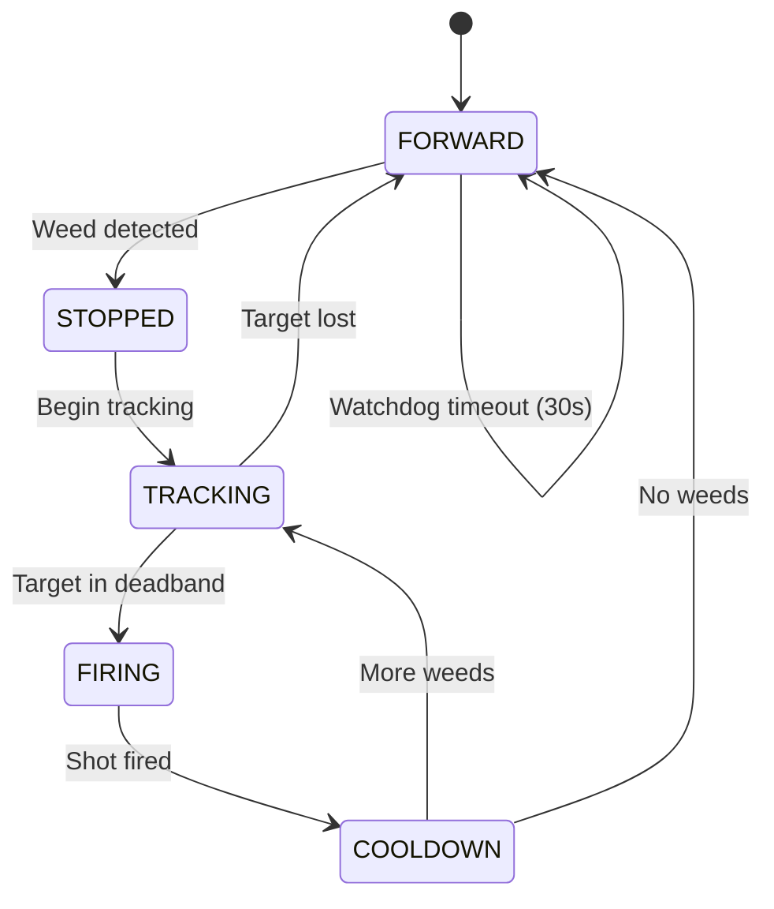

```markdown
# 🌱 AI Weed Detection & Smart Crop Monitoring

<div align="center">

**Hệ thống phát hiện cỏ dại và giám sát cây trồng thông minh trên Raspberry Pi 4B**

[](https://python.org)
[](https://ultralytics.com)
[](https://raspberrypi.org)
[](https://flask.palletsprojects.com)
[](LICENSE)

</div>

---

## 📌 Overview

**AI Weed Detection** là hệ thống nhúng chạy trên **Raspberry Pi 4B**, sử dụng **YOLOv8** để phát hiện cỏ dại và theo dõi cây trồng theo thời gian thực. Khi phát hiện cỏ dại, hệ thống tự động điều khiển servo pan/tilt để aim laser tiêu diệt mục tiêu, đồng thời hiển thị dữ liệu trực tiếp lên Web Dashboard.

```
Camera ──→ YOLOv8 ──→ error_x / error_y ──→ Servo Pan/Tilt ──→ Laser
                  └──→ Crop Tracking ──→ Web Dashboard (Flask)
```

### Pipeline chi tiết

```
┌─────────────────────────────────────────────────────────────┐
│                     Raspberry Pi 4B                          │
│                                                             │
│  Camera (USB/CSI)                                           │
│       │                                                     │
│       ▼                                                     │
│  YOLOv8 Inference (.pt / .onnx)                             │
│       │                                                     │
│       ├── class=weed ──→ State Machine                      │
│       │                  FORWARD → STOPPED → TRACKING       │
│       │                  → FIRING → COOLDOWN                │
│       │                       │                             │
│       │                  Servo PCA9685 (pan/tilt)           │
│       │                       │                             │
│       │                  Laser pulse (50ms, cap 1s)         │
│       │                  Motor L298N (stop/go)              │
│       │                                                     │
│       └── class=crop ──→ Crop Tracker                       │
│                          → Capture image                    │
│                          → Classify stage                   │
│                          → Growth history                   │
│                               │                             │
│                          Web Dashboard :5000                │
└─────────────────────────────────────────────────────────────┘
```

---

## ✨ Features

- 🧠 **YOLOv8 Realtime** — Detect cỏ dại + cây trồng, hỗ trợ `.pt` và `.onnx`
- 🔄 **State Machine** — `FORWARD → STOPPED → TRACKING → FIRING → COOLDOWN`
- 🎯 **Servo Pan/Tilt** — PCA9685 I2C, góc 20–160°, offset calibration
- 🔦 **Laser Pulse** — Xung 50ms, safety hard cap 1s, `try/finally` đảm bảo OFF
- ⚙️ **Motor L298N** — Tự hành, dừng khi phát hiện cỏ, chống spam GPIO
- 🌐 **Web Dashboard** — Flask tại `:5000`, camera live stream, stats, crop tracking
- 🌿 **Crop Tracking** — Theo dõi cây, chụp ảnh, phân loại giai đoạn, lịch sử tăng trưởng
- 🛡️ **Safety System** — SIGTERM handler, watchdog, laser failsafe
- 💻 **Simulation Mode** — Chạy test trên PC không cần GPIO

---

## 📁 Project Structure

```
detect-iot/
├── main.py                         # Entry point — state machine + Web server
├── run_weed_laser.py               # Multi-target weed + laser runner
├── requirements.txt                # Python dependencies
│
├── hardware/                       # Hardware abstraction layer
│   ├── wiring.py                   # Central pin mapping
│   ├── laser_control.py            # Laser pulse + safety cap
│   ├── motor_l298n.py              # L298N motor driver
│   ├── servo_control.py            # Servo GPIO PWM (fallback)
│   └── servo_pca9685.py            # Servo PCA9685 I2C (primary)
│
├── models/                         # Trained model weights
│   ├── best.pt                     # YOLOv8 PyTorch
│   └── best.onnx                   # ONNX (optimized for Pi)
│
├── utils/                          # Utility modules
│   ├── camera_pi.py                # USB / CSI camera abstraction
│   ├── coordinate_convert.py       # Pixel → servo angle
│   ├── rt_tasks.py                 # Real-time task helpers
│   └── shared_state.py             # Thread-safe state (Web ↔ detection)
│
├── webapp/                         # Web Dashboard
│   ├── app.py                      # Flask server + REST API
│   ├── templates/index.html        # Dashboard UI
│   └── static/style.css            # Stylesheet
│
├── scripts/                        # Utility scripts
│   ├── selftest_pi_hardware.py     # Hardware self-test
│   ├── setup_samba_pi.sh           # Samba file share setup
│   └── deploy.sh                   # One-command deploy
│
├── config/                         # YOLO dataset config
├── docs/
│   └── CHUCNANG.md                 # Feature roadmap
├── captures/                       # Crop snapshot storage
├── yolov8n.pt                      # YOLOv8 nano pretrained base
├── RUN_RASPBERRY_PI.md             # Pi-specific run guide
└── README.md
```

---

## 🔌 Hardware

### Components

| Component | Model | Interface |
|-----------|-------|-----------|
| MCU | Raspberry Pi 4B (2GB+) | — |
| Camera | USB Webcam / Pi Camera v2/v3 | USB / CSI |
| Servo Driver | PCA9685 | I2C |
| Servo Pan | Standard Servo | PCA9685 Ch.14 |
| Servo Tilt | Standard Servo | PCA9685 Ch.15 |
| Laser | Laser Diode + Transistor | BOARD 16 |
| Motor Driver | L298N | BOARD 32, 33 |

### Wiring Summary

```
PCA9685 ──(I2C)──→ Raspberry Pi (SDA/SCL)
  Ch.14 ──────────→ Servo Pan
  Ch.15 ──────────→ Servo Tilt

GPIO BOARD 16 ──→ Transistor Base ──→ Laser
GPIO BOARD 32 ──→ L298N IN3
GPIO BOARD 33 ──→ L298N IN4
```

> ⚙️ Thay đổi pin mapping tại `hardware/wiring.py`

---

## 🚀 Getting Started

### Prerequisites

- Raspberry Pi 4B — Raspberry Pi OS 64-bit (Bullseye/Bookworm)
- Python 3.9+
- I2C enabled (`raspi-config`)
- Camera enabled (`raspi-config`)

### 1. Clone

```bash
git clone https://github.com/your-username/ai-weed-detection.git
cd ai-weed-detection
```

### 2. Quick Install (recommended)

```bash
sudo bash scripts/deploy.sh
```

### 3. Manual Install

```bash
# System packages
sudo apt update && sudo apt install -y \
  python3-pip python3-picamera2 i2c-tools

# Enable interfaces
sudo raspi-config nonint do_i2c 0
sudo raspi-config nonint do_camera 0

# Python packages
pip install -r requirements.txt
pip install adafruit-circuitpython-servokit flask

# Create directories
mkdir -p logs captures models

# Copy your trained model
scp best.pt pi@<pi-ip>:/home/pi/ai-weed-detection/models/
```

### 4. Run

```bash
# Production — with Web Dashboard
python main.py --picam2 --web --fps 8

# Debug — with preview window
python main.py --camera 0 --show

# Multi-target weed + laser
python run_weed_laser.py --pca9685 --show --state-debug-log

# Hardware self-test
python scripts/selftest_pi_hardware.py

# Web Dashboard only
python webapp/app.py
```

---

## ⚙️ CLI Reference

| Argument | Default | Description |
|----------|---------|-------------|
| `--model` | `models/best.pt` | Model path (`.pt` or `.onnx`) |
| `--camera` | `0` | USB camera index |
| `--picam2` | off | Use Pi Camera CSI |
| `--conf` | `0.2` | Detection confidence threshold |
| `--fps` | `10` | Target inference FPS |
| `--imgsz` | `320` | Inference image size |
| `--show` | off | Enable debug preview window |
| `--web` | off | Enable Web Dashboard |
| `--web-port` | `5000` | Dashboard port |
| `--pan-gain` | `0.06` | P-controller gain — pan axis |
| `--tilt-gain` | `0.06` | P-controller gain — tilt axis |
| `--offset-pan` | `0` | Laser-camera offset (degrees) |
| `--offset-tilt` | `0` | Laser-camera offset (degrees) |
| `--laser-pulse-ms` | `50` | Laser pulse duration (ms) |
| `--max-shots` | `3` | Max shots per weed target |
| `--state-timeout-sec` | `30` | Watchdog reset timeout |

---

## 🔄 State Machine



---

## 🌐 Web Dashboard

Truy cập `http://<pi-ip>:5000` khi chạy với flag `--web`.

### Pages

| Page | Description |
|------|-------------|
| **Overview** | Camera live stream, 4 KPI cards, activity chart |
| **Crop List** | Table với search, filter, click để xem chi tiết |
| **Crop Detail** | Ảnh chụp, kích thước, giai đoạn, lịch sử tăng trưởng |

### REST API

| Endpoint | Method | Description |
|----------|--------|-------------|
| `/` | GET | Dashboard HTML |
| `/video_feed` | GET | MJPEG live stream (20 FPS) |
| `/api/stats` | GET | Detection statistics JSON |
| `/api/plants` | GET | Plant list JSON |
| `/api/plants/<id>` | GET | Plant detail JSON |
| `/api/plants/<id>/image` | GET | Plant snapshot image |
| `/api/plants/<id>/history` | GET | Growth history JSON |
| `/health` | GET | Health check |

---

## 🛡️ Safety

| Mechanism | Description |
|-----------|-------------|
| **Laser hard cap** | Max 1s/pulse — `try/finally` đảm bảo OFF |
| **SIGTERM handler** | `systemctl stop` → laser OFF trong < 100ms |
| **Watchdog** | State bị kẹt > 30s → force `FORWARD` |
| **Max shots** | Tối đa 3 phát/mục tiêu → tiếp tục di chuyển |
| **Failsafe finally** | Laser OFF trước mọi cleanup routine |
| **GPIO isolation** | Mỗi module tự cleanup pin riêng |

> ⚠️ **Warning:** Luôn đeo **kính bảo hộ laser** đúng bước sóng trước khi bật laser > 5mW.
> Laser công suất cao chiếu vào mắt = **mù vĩnh viễn**.

---

## 🎯 Laser Calibration Guide

### Step 1 — Calibrate offset laser-camera

```bash
# Bắt đầu với offset = 0, bắn vào giấy A4
python main.py --picam2 --show --offset-pan 0 --offset-tilt 0

# Quan sát laser lệch so với tâm bbox → điều chỉnh
python main.py --picam2 --show --offset-pan -3 --offset-tilt 2

# Lặp lại đến khi laser trúng tâm bbox
```

### Step 2 — Tune servo gain

| Gain | Behavior |
|------|----------|
| `> 0.1` | Servo dao động, không settle |
| `0.04 – 0.07` | Smooth, settle nhanh ✅ |
| `< 0.02` | Chậm, không kịp aim |

### Step 3 — Laser power vs pulse duration

| Power | Effectiveness | Recommended Pulse |
|-------|--------------|-------------------|
| 5mW | Không diệt được cỏ | — |
| 500mW – 1W | Diệt cỏ non | 200–500ms |
| > 2W | Diệt cỏ cứng | 100–300ms |

```bash
python main.py --picam2 --laser-pulse-ms 300
```

---

## ✅ Pre-flight Checklist

```
☐ 1.  selftest_pi_hardware.py PASS
☐ 2.  YOLO predict trên ảnh test → nhận diện đúng
☐ 3.  Chạy --show → bbox đúng vị trí
☐ 4.  Chạy với laser rút dây → servo aim đúng hướng
☐ 5.  Cắm laser 5mW → bắn vào giấy A4 → đo offset
☐ 6.  Calibrate --offset-pan + --offset-tilt → laser trúng tâm
☐ 7.  Tăng --laser-pulse-ms lên 200–500ms
☐ 8.  Đổi sang laser công suất cao (> 500mW)
☐ 9.  ĐEO KÍNH BẢO HỘ LASER trước khi bật laser mạnh
☐ 10. Test ngoài thực tế
```

---

## 🔧 Systemd Service

```bash
# Install
sudo cp scripts/weed-detect.service /etc/systemd/system/
sudo systemctl daemon-reload
sudo systemctl enable weed-detect
sudo systemctl start weed-detect

# Manage
sudo systemctl status weed-detect       # Status
sudo systemctl stop weed-detect         # Stop
sudo systemctl restart weed-detect      # Restart
sudo journalctl -u weed-detect -f       # Live logs
```

---

## 🗺️ Roadmap

### ✅ Completed

- [x] YOLOv8 realtime — `.pt` & `.onnx` support
- [x] State machine — 5 states
- [x] Servo pan/tilt — PCA9685 I2C + offset calibration
- [x] Laser pulse — safety cap + `try/finally` failsafe
- [x] Motor L298N — auto-stop on detection
- [x] Web Dashboard — Flask, MJPEG stream, REST API
- [x] Crop tracking — capture, stage classification, growth history
- [x] SIGTERM / SIGINT safe shutdown
- [x] Simulation mode on PC (no GPIO)

### 🚧 In Progress

- [ ] Multi-class crop detection — Lettuce, Tomato, Cabbage...
- [ ] Plant count per species
- [ ] Auto CSV history export
- [ ] Growth chart on dashboard
- [ ] Abnormal growth alert

### 📋 Planned

- [ ] Cloud sync — push data to remote server
- [ ] Mobile app — remote dashboard
- [ ] Multi-Pi — multiple robots, unified dashboard
- [ ] AI upgrade — disease classification, yield prediction
- [ ] Auto-calibrate — automatic laser-camera alignment
- [ ] Solar power — Li-Po + solar panel for field use
- [ ] GPS mapping — garden map with per-plant GPS location
- [ ] Weather integration — correlate growth with weather data
- [ ] OTA update — remote model/firmware update

---

## 📋 Notes

- Model classes: `0 = crop` · `1 = weed`
- Chạy trên PC không có GPIO → tự động **Simulation Mode**
- Toàn bộ pin mapping tập trung tại `hardware/wiring.py`
- Web Dashboard chạy độc lập: `python webapp/app.py`

---

## 📄 License

This project is licensed under the **MIT License** — see [LICENSE](LICENSE) for details.

---

<div align="center">

Made with ❤️ by **Đào Văn Phong**

*Raspberry Pi · YOLOv8 · Flask · PCA9685 · L298N*

</div>
```
